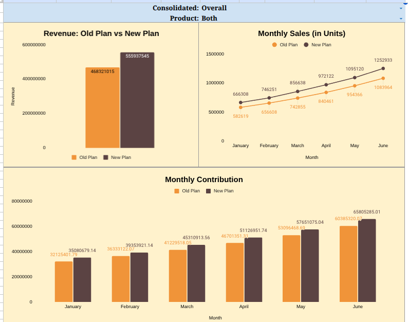

# Cost-Benefit-Analysis
A health drink producer company wants to evaluate whether it'd be beneficial to introduce a new pack for the IPL campaign. Our analysis shows region-wise, city-wise and product-wise performance for the existing and new plan.
Overview-
Cost Benefit Analysis is an effective way for the organizations to determine whether to launch a new product during a special event or in general or not. It provides an overview on the increased contribution and profit.
Comprehnsive Sales Report shows the comparison of revenue and sold units for both old and new plan. The values are adjusted as per selections made. One can compare the metrics between different regions, cities and products.  

Dashboard 1
Made a dynamic and interactive dashboard which adjusts automatically based on the selected area and product.
Key Metrics:
Revenue
Monthly Units Sold
Monthly Contribution

